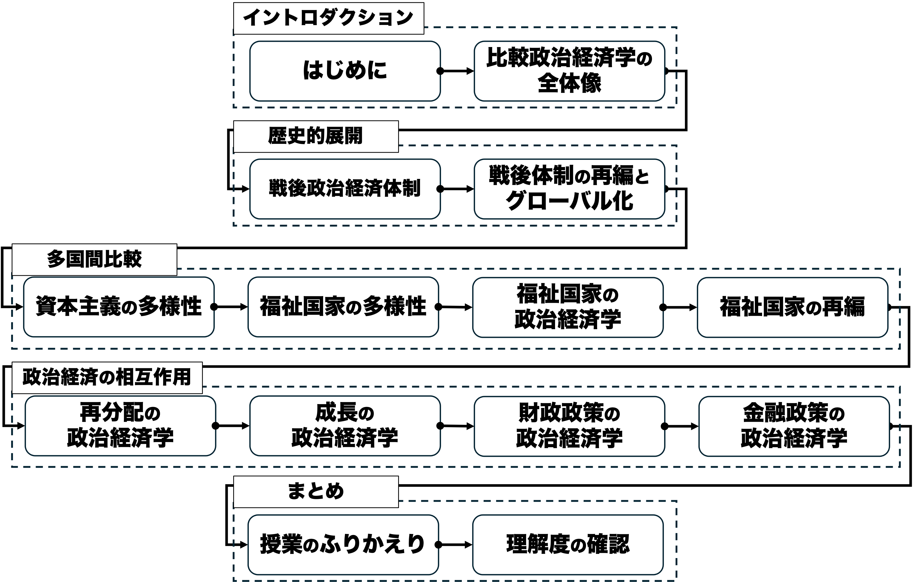

## 今日の目次

1. はじめに
1. 授業概要
1. 諸注意と評価
1. 比較政治経済学とは何か
1. 後期で学ぶこと
1. まとめ

# はじめに
## 授業資料と最新版シラバス
<!-- {.r-stretch .center} -->

## 本日の目的と到達目標
#### 目的
本科目の目的・計画・評価方法・諸注意を紹介し、受講の可否の判断材料を提供する。仲間と受講の動機を共有し、今後学んでいくための環境を整える。

::: {.fragment .fade-in}
#### 到達目標
1. 本科目「比較政治経済分析」の目的、進め方、評価方法を他人に説明できる。
1. 比較政治経済学とはどのような学問かを説明できる。
1. 自分の興味関心を言語化し、本科目で学びたいことを他人に説明できる。

:::

## 担当者の自己紹介
::: {.columns}
::: {.column width=25%}

 - [[email]{.button}](mailto:jsuzuki@iss.u-tokyo.ac.jp)
 - [[webpage]{.button}](https://junpei-suzuki.github.io)
 - [[researchmap]{.button}](https://researchmap.jp/junpeisuzuki-ps)
 - [[Podcast]{.button}](https://open.spotify.com/episode/5EmfMuzgwuTSLuMblepmTp?si=_d_BnbJ-QSOIBMeldISyVg)
 
:::

::: {.column width=5%}
:::

::: {.column width=70%}
::: {.fragment .fade-in}
**鈴木淳平**（すずき・じゅんぺい）

駒澤大学法学部政治学科講師
:::

::: {.incremental}
 - 学位：早稲田大学博士（政治学）（2024年）
 - 職歴：早稲田大学助手→東京大学特任研究員→駒澤大学講師
 - 専門：先進諸国の比較政治経済学

:::

:::

:::

# 授業概要
## 授業概要
::: {.incremental}
- 特に先進諸国における**政治**と**経済**の関わりについて、国際関係論の視点から考察できる能力を身につける
- **比較政治経済学**（IPE）の研究成果から関連する**概念・理論・モデル**を学ぶ
- **戦後体制**や**グローバル化**、**資本主義**・**福祉国家**の多様性、**再分配**や**成長**、**財政・金融政策**を学ぶ
- 講義方式によるが、**アクティブラーニング**を用いたワークを積極的に活用

:::

## 到達目標
::: {.incremental}
1. 学問領域としての**比較政治経済学**を説明できる。
2. 先進諸国に広まった**政治経済体制**の特徴を列挙しつつ、その**歴史的展開**を描写できる。
3. 先進各国における政治経済のあり方について、特に**資本主義**と**福祉国家**に着目して比較できる。
4. 比較政治経済学の概念・理論・モデルを用いて、**政治と経済との相互作用**を議論できる。

:::

## 進行計画
{width=100%}

# 諸注意と評価
## 授業の進め方
::: {.incremental}
- 基本的は対面の講義方式で、スライドを使用
- 授業資料等はMoodleで共有
    - スライドのハードコピーは配布はしない予定なので、各自でダウンロードすること
- 随時アクティブラーニングも取り入れ、「聞くだけ」の授業にはしない
    - 事後学習、問いかけ、アンケート、ディスカッション⋯
 - **事後学習**⋯授業の3日後（木曜日）を締切として、オン
ラインのフォーム上でリアクションペーパー記入（合計100字程度）
   - 次回授業でなるべくフィードバック予定

:::

## 連絡方法とオフィスアワー
::: {.incremental}
- コンタクトは必ず担当者の[メールアドレス](mailto:jsuzuki@komazawa-u.ac.jp)に行うこと
    - Moodleのメッセージ機能では気づかない可能性大
- メールを送付する際は「[メールの書き方](http://www2.ipcku.kansai-u.ac.jp/~iwamoto/email.pdf)」を必ず参照し、形式やマナーを守ること
- 非常勤講師のためオフィスアワーはなし
    - 授業の前後、メール、あるいはアポによりオンラインで
対応可能

:::

## その他注意
::: {.incremental}
 - オンラインのツールを用いることがあるので、できるだけ電子機器持参
 - 授業計画は若干の変更の可能性あり

:::

## 評価
::: {.fragment .fade-in}
**平常点**（30%）⋯事後学習のリアクションペーパー

 - 授業で学んだことと感想

:::

::: {.fragment .fade-in}
**試験**（70%）⋯期間内試験として実施

 - 選択式問題＋記述式問題
 - 各回授業の目標到達度を測定

:::

# 比較政治経済学とは何か
## 質問（わせポチ）
比較政治経済学とはどのような学問だと思いますか？

## 政治学の構成
::: {.fragment .fade-in}
1. **アメリカ政治**（American Politics）
1. **比較政治**（Comparative Politics）
1. **公共政策**（Public Policies）
1. **政治理論**（Political Theory）
1. **国際関係論**（International Relations）

:::

## 比較政治経済学
#### comparative political economy: CPE
::: {.incremental}
- 位置付け：**比較政治学**の下位分野
- 目的：**政治**と**経済**、**国家**と**市場**の関係を扱う
- 特徴：**比較**の視点→**国家の内部**における政治と経済の関係
   - Cf. **国際政治経済学** (IPE)…**越境する経済活動**と**政治**の関わり
      - 国際関係論の下位分野→**国家同士**の関係
      - 貿易や国際金融など

:::

## 具体的なテーマ
{width=100%}

::: {.notes}
具体的なトピック

- 戦後体制やグローバル化
- 資本主義や福祉国家の多様性
- 再分配や経済成長戦略
- 財政政策や金融政策

:::

# アイスブレイク
## 質問（わせポチ）
目的：自分の受講動機を整理し、本科目で学ぶことを意識する

1. なぜこの授業を受講しようと思ったのか、理由を自由に書き込んでください。
1. シラバスや先ほどの話から、興味を持ったトピックやワードやその理由を自由に書き込んでください。

# まとめ
## 本日の目的と到達目標
#### 目的
本科目の目的・計画・評価方法・諸注意を紹介し、受講の可否の判断材料を提供する。仲間と受講の動機を共有し、今後学んでいくための環境を整える。

::: {.fragment .fade-in}
#### 到達目標
1. 本科目「比較政治経済分析」の目的、進め方、評価方法を他人に説明できる。
1. 比較政治経済学とはどのような学問かを説明できる。
1. 自分の興味関心を言語化し、本科目で学びたいことを他人に説明できる。

:::

## 次回までに
#### 事前学習
- 教科書（序章）を読む。

#### 事後学習

 - 授業資料を見直し、目標到達をセルフチェック
 - Moodle上でのリアクションペーパー入力（木曜日まで）
    - 今回は練習なので成績評価には含めません。