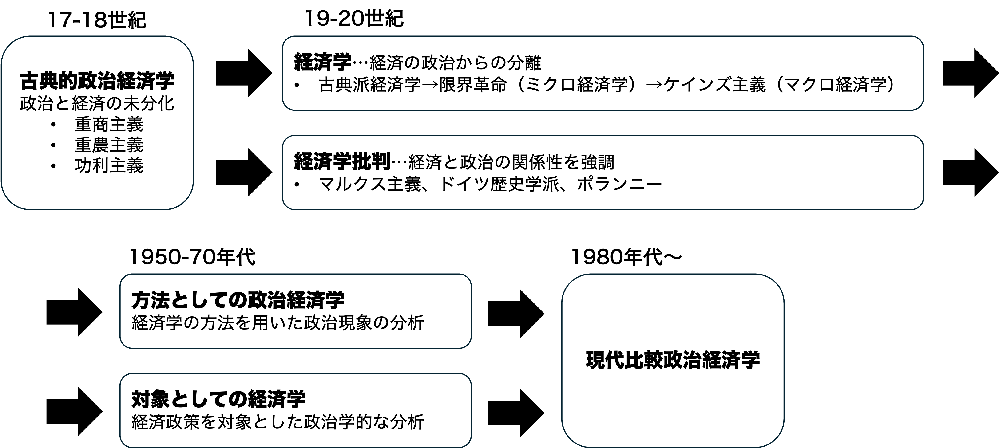

## 今日の目次

1. はじめに
1. 政治と経済
1. 財の種類と公共財
1. 政治経済学の歴史
1. 政治経済学のアプローチ
1. まとめ

# はじめに
## 先週のRP
TBD

## 本日の目的と到達目標
#### 目的
政治と経済はそれぞれ何でどのような関係にあるのかを考察するとともに、比較政治経済学の全体像をつかむ。排除性と競合性に注目して財を分類するとともに、現代の比較政治経済学が誕生するまでの歴史的展開や3つのアプローチを概観する。

::: {.fragment .fade-in}
#### 到達目標
1. 価値の配分に着目して、政治と経済の違いを説明できる。
1. 競合性と排除性に着目して、財の種類を4つに分類できる。
1. 現代の政治経済学が成立するまでの歴史的過程を説明できる。
1. 政治経済学の3つのアプローチ（アクター中心・制度中心・アイデア中心）をそれぞれ説明できる。

:::

# 政治と経済
## 質問
2年生までの授業で、**デイビッド・イーストン**の政治の定義を習っていると思います。

その内容を思い出してください。

思い出せない場合は調べても構いません。

## 政治と経済の違い
::: {.columns}
::: {.column width=70%}
#### 比較政治経済学 (CPD)
**政治**と**経済**、**国家**と**市場**の関係を扱う分野

::: {.fragment .fade-in}
#### 政治 (politics)
価値の**権威**的配分

::: {.incremental}
- 例：徴税と再分配→強制力が伴う

:::

:::

::: {.fragment .fade-in}
#### 経済 (economy)
価値の**水平**的配分

::: {.incremental}
- 例：コンビニにおける買い物→市場における自発的交換

:::

:::

:::

::: {.column width=30%}

:::

:::

## 政治と経済の関係
::: {.incremental}
1. **公共財**の提供
   - **フリーライダー問題**による過小供給
   - 強制力による解決
1. **公平性**の確保
   - 生存権や社会権の保障
   - 戦後の**混合経済**化
      - 例：産業国有化、公共事業、規制、福祉

:::

## G7諸国の政府支出（対GDP比）
<iframe src="https://ourworldindata.org/grapher/historical-gov-spending-gdp?tab=line&country=JPN~USA~DEU~GBR~FRA~ITA~CAN" loading="lazy" style="width: 100%; height: 600px; border: 0px none;" allow="web-share; clipboard-write"></iframe>

# 財の種類と公共財
## 財の2つの性質
::: {.incremental}
- **排除性**…対価を支払わない人を排除できること
- **競合性**…ある人の消費が他の人の消費を妨げること

:::

::: {.fragment .fade-in}
例：ペットボトルの水

::: {.incremental}
- 排除性→対価を支払わないと入手不可
- 競合性→誰かが飲んだら他の人は消費不可

:::
:::

## 4種の財
::: {.fragment .fade-in}
|              | 排除可能 | 排除不能 | 
| ------------ | -------- | -------- | 
| **競合的**   | 私的財   | 共有財   | 
| **非競合的** | クラブ財 | 公共財   | 

:::

::: {.fragment .fade-in}
ワーク（わせポチ）…私的財・クラブ財・共有財・公共財の例をそれぞれ1つずつ考え、書き込んでみてください。
:::

::: {.fragment .fade-in}
私的財以外は「（広義の）**公共財**」

::: {.incremental}
- 「**市場の失敗**」…市場に任せると過小供給
- 政府による強制力＝価値の権威的配分＝政治が必要

:::
:::

## オルソン『集合行為論』[^olson1965]
::: {.columns}

::: {.column width=65%}
#### 集合行為 (collective action)
ある集団の共通の利益を達成するための行動

::: {.fragment .fade-in}
#### フリーライダー問題 (free-rider problem)
合理的な個人は集合行為から逃れる誘因をもつ
:::

::: {.fragment .fade-in}
例：国防サービス

::: {.incremental}
- 国防サービスの提供は集合行為
- その利益は国民全員に恩恵
- 集合行為に協力しないのが合理的

:::
:::
:::

::: {.column width=30%}
{width=70%}

:::

:::

[^olson1965]: Olson, Mancur. 1965. *The Logic of Collective Action: Public Goods and the Theory of Groups*

# 政治経済学の歴史
## 質問
今日の事前学習課題（教科書）によると、次のテーマはどのような順番で出てきたでしょうか

1. ケインズ主義
1. 古典派経済学
1. マルクス主義
1. 古典的政治経済学
1. 限界効用革命
1. 現代政治経済学

## 政治経済学の歴史的展開
{.r-stretch}

## 方法としての政治経済学
**経済学の方法**を用いた政治分析

::: {.incremental}
- 経済学における**公共選択論**、**社会的選択論**

:::

::: {.fragment .fade-in}
例：

::: {.incremental}
- アローの不可能性定理…民主主義の下での多数決の失敗
- ダウンズ…合理的選択論に基づいた有権者と政治家の分析
- オルソン…合理的個人の集合行為の困難さ

:::
:::

## 対象としての政治経済学
**経済政策を対象**とした政治学的な分析

::: {.incremental}
- 比較政治学の系譜→国ごとの違いに焦点

:::

::: {.fragment .fade-in}
例：

::: {.incremental}
- 比較福祉国家研究…国ごとの福祉政策のあり方の違い
- コーポラティズム論…労使関係をめぐる制度
- 資本主義の多様性論…企業行動をめぐる制度

:::
:::

# 政治経済学のアプローチ
## 現代比較政治経済学
1980年代以降に**比較政治経済学**が成立

::: {.incremental}
- 方法としての政治経済学と対象としての政治経済学が合流
- 古典的政治経済学と対比して**新政治経済学**とも呼ぶ

:::

::: {.fragment .fade-in}
3つのアプローチ

::: {.incremental}
1. アクター中心アプローチ
1. 制度中心アプローチ
1. アイデア中心アプローチ

:::
:::

## アクター中心アプローチ
::: {.fragment .fade-in}
**アクター（登場人物）**に注目
:::

::: {.fragment .fade-in}
→「アクターは何を考えて行動しているのか」
:::

::: {.fragment .fade-in}
#### **合理的選択論**（Rational Choice Theory）
::: {.incremental}
- 経済学における基本的な考え
- アクターは効用を最大化するべく行動と仮定
- 例：**政治的景気循環**（political business cycle）
    - 現職の政府は再選を目指す
    - 選挙前に財政支出増→選挙サイクルと景気循環の一致

:::
:::

## 制度中心アプローチ
::: {.fragment .fade-in}
**古典的制度論**⋯今ある制度（法律や慣習など）の記述に力点

:::

::: {.fragment .fade-in}
**新制度論**（New Institutionalism）⋯制度を「アクターの行動を決めるルール」としてとらえる考え方

:::

::: {.incremental}
- **歴史的制度論**⋯経路依存性への着目
    - 例：福祉国家の経路依存性
- **合理的選択制度論**⋯制度が利益・コストを規定
    - 例：民主主義と経済成長
- **社会学的制度論**⋯慣習や信念などの非公式な制度
    - 例：アフリカ新興国における科学省

:::

## アイデア中心アプローチ
言説・信念・規範などに注目

::: {.incremental}
- 政治エリート間の合意と市民の支持を調達

:::

::: {.fragment .fade-in}
例：福祉国家縮減の政治学

::: {.incremental}
- 1970年代以降の財政悪化→福祉削減が争点化
- デンマークの「**フレキシキュリティ**」（90年代）
   - flexibility (柔軟性) + security (保障)
   - 政府支出を給付から教育・労働訓練へと転換

:::
:::

## Think-pair-share (10分)
日本は他の先進国と比べると社会保障支出が少ないという特徴があります。

この現象を以下の3つのアプローチで説明するとしたらどのようになるでしょうか。

1. アクター中心…誰がどのような利益を持っているか
1. 制度中心…どのような制度が政策を制約しているか
1. アイデア中心…どのような価値観・信念・言説が政策を支えているか

::: {.notes}
アクター中心

- 企業が社会保険料や税負担の増加を嫌い、社会保障拡大に反対する。
- 高所得者・富裕層が増税に反対するため、再分配政策が拡大しにくい。
- 高齢者は社会保障の受益者として強い政治的影響力を持つ一方、現役世代の負担増には反発する。
- 若年層は社会保障の受益が将来に偏るため、現在の負担増を支持しにくい。
- 政党が、こうした有権者・利益団体の選好を考慮して政策を選択する。

制度中心

- 日本の雇用・労働市場制度が、企業による社会保障への関与の仕方を規定している。
- 社会保険制度が既に存在するため、新しい普遍的な社会保障制度を作る必要性・余地が小さい。
- 財政制度によって、社会保障拡大に利用できる財源が制約されている。
- 選挙制度や政党システムが、政党がどのような有権者に訴えるかを左右している。
- 過去に形成された制度が既得権益や期待を生み、制度を大きく変更することが難しくなっている（経路依存性）。

アイデア中心

- **「自助」や「自己責任」**を重視する価値観が、政府による社会保障拡大への支持を弱める。
- 「家族が高齢者を支えるべき」という家族主義的な規範が存在する。
- 「政府は大きくなりすぎるべきではない」という考え方が、社会保障拡大を正当化しにくくする。
- 社会保障を「権利」と捉えるか、「困窮者への救済」と捉えるかによって、支持が変わる。
- 「少子高齢化だから社会保障を削減しなければならない」といった**問題の捉え方（フレーミング）**が政策選択に影響する。

:::

# まとめ
## 本日の目的と到達目標
#### 目的
政治と経済はそれぞれ何でどのような関係にあるのかを考察するとともに、比較政治経済学の全体像をつかむ。排除性と競合性に注目して財を分類するとともに、現代の比較政治経済学が誕生するまでの歴史的展開や3つのアプローチを概観する。

::: {.fragment .fade-in}
#### 到達目標
1. 価値の配分に着目して、政治と経済の違いを説明できる。
1. 競合性と排除性に着目して、財の種類を4つに分類できる。
1. 現代の政治経済学が成立するまでの歴史的過程を説明できる。
1. 政治経済学の3つのアプローチ（アクター中心・制度中心・アイデア中心）をそれぞれ説明できる。

:::

## 次回までに
#### 事前学習
- 教科書（第1章1-3）を読む。

#### 事後学習

 - 授業資料を見直し、目標到達をセルフチェック
 - Moodle上でのリアクションペーパー入力（木曜日まで）
