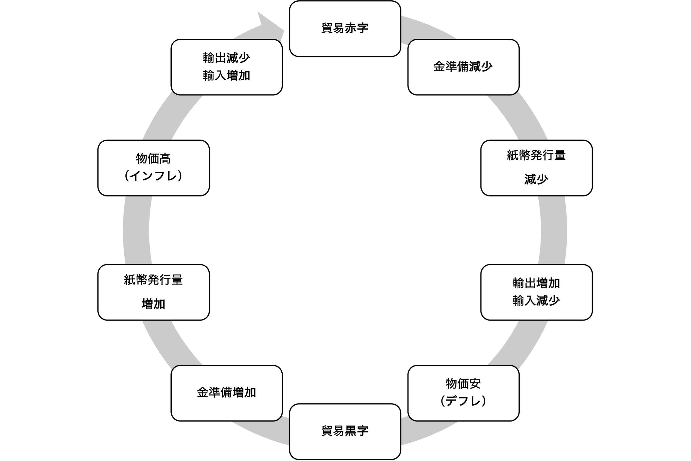

## 今日の目次

1. はじめに
1. パックス・ブリタニカ
1. 戦後国際体制の概要
1. 埋め込まれた自由主義
1. ケインズ主義経済学
1. まとめ

# はじめに
## 先週のRP
TBD

## 本日の目的と到達目標 {.smaller}
#### 目的
戦後先進国で成立した政治経済体制はどのようなものであるのか、その基本的な特徴を理解する。まず19世紀のパックス・ブリタニカの下で成立した自由主義体制について概観したのち、戦後の国際政治経済体制の特徴を19世紀体制と対比する形で議論する。戦後体制を説明する概念として「埋め込まれた自由主義」や、理論的基盤となったケインズ主義経済学を詳しく考察する。

::: {.fragment .fade-in}
#### 到達目標
1. 19世紀のパックス・ブリタニカの下で成立した自由主義体制とはどのような体制だったかを説明できる。
1. パックス・ブリタニカと対比しながら、戦後の国際政治経済体制を説明できる。
1. 「埋め込まれた自由主義」という概念を説明できる。
1. 戦後福祉国家を理論的に正当化したケインズ経済学について、古典派経済学と対比しつつ説明できる。

:::

# パックス・ブリタニカ
## パックス・ブリタニカ (pax britannica)
イギリスの覇権の下で国際関係が安定していた19世紀から第一次世界大戦までの時代

::: {.incremental}
- **自由貿易主義**…古典派経済学（比較優位モデル）に基づく
- **金本位制**…一定の比率のもとで政府が自国通貨（＝**兌換紙幣**）と金の交換を保証する制度 
- **自由放任国家**…国家は市場に介入しない

:::

::: {.notes}
- **自由貿易主義**…古典派経済学（比較優位モデル）
   - 古典派経済学（比較優位モデル）→貿易による富の増加
   - イギリスの優位性を背景に押し付けられる
   - 海運の安全確保による円滑化
- **金本位制**…一定の比率のもとで政府が自国通貨（＝**兌換紙幣**）と金の交換を保証する制度 
   - 貿易収支は金準備と物価水準を通じて自動的に調整
- **自由放任国家**…国家は市場に介入しない
   - 古典派経済学→介入は国内の価格調整メカニズムをダメにするし、貿易のメリットも失わせる
   - 金本位制もまた介入政策を制約する

:::

## 金本位制における調整メカニズム
{.r-stretch}

## 質問（わせポチ）
金本位制を採っている日本政府が金準備と比較して多くの兌換紙幣を発行したとします。どのような問題が起こると思いますか。

## PBの崩壊
::: {.fragment .fade-in}
**第一次世界大戦**（1914-18）

::: {.incremental}
- 貿易制限と金本位制の停止
- イギリス覇権の失墜

:::
:::

::: {.fragment .fade-in}
**戦間期の協調**（1919-29）

::: {.incremental}
- ヴェルサイユ条約（1919）をめぐる混乱
-  **ドーズ案** (1924) と**ヤング案** (29)→国際関係の安定化、金本位制への復帰、貿易の回復

:::
:::

::: {.fragment .fade-in}
**世界恐慌**（1929）

::: {.incremental}
- 金本位制停止とブロック経済化
- 第二次世界大戦へ

:::
:::

# 戦後国際体制の概要
## 戦後国際政治経済体制
イギリスに代わって覇権を握った**アメリカ**が主導

::: {.incremental}
- **関税及び貿易に関する一般協定**（GATT）
   - **多国間主義**に基づく**自由貿易の推進**のためのルール
   - 例外：農産物の適用除外やセーフガード
- **ブレトン・ウッズ体制**
   - USドルを基軸通貨とする**固定相場制**
   - 例外：調整可能な固定相場、IMF安定化基金

:::

## 戦後体制の繁栄
::: {.panel-tabset}
#### 貿易開放性

<iframe src="https://ourworldindata.org/grapher/globalization-over-5-centuries?time=1945..latest&tab=chart" loading="lazy" style="width: 100%; height: 600px; border: 0px none;" allow="web-share; clipboard-write"></iframe>

#### 一人あたりGPD

<iframe src="https://ourworldindata.org/grapher/gdp-per-capita-maddison-project-database?tab=line&time=1940..latest&country=~OWID_WRL" loading="lazy" style="width: 100%; height: 600px; border: 0px none;" allow="web-share; clipboard-write"></iframe>

#### トップ1%所得比

<iframe src="https://ourworldindata.org/grapher/incomes-of-the-richest?tab=line&time=1945..latest&country=~OWID_WRL&quantile=richest_1pct&welfare_type=before_tax&hideControls=false" loading="lazy" style="width: 100%; height: 674px; border: 0px none;" allow="web-share; clipboard-write"></iframe>

:::

## まとめ：2つの国際体制
::: {.fragment .fade-in}
|                    | パックス・ブリタニカ | 戦後国際政治経済体制 | 
| ------------------ | -------------------- | -------------------- | 
| **覇権**           | イギリス             | アメリカ             | 
| **貿易**           | 自由貿易             | 自由貿易             | 
| **為替**           | 金本位制             | 固定相場制           | 
| **国内経済と国家** | 自由放任国家         | 福祉国家             | 
| **国家の自律性**   | 低い                 | 高い                 | 

:::

::: {.fragment .fade-in}
Q. なぜ戦後体制は、自由貿易と国家の自律性を両立させようとしたのか？（わせポチ）
:::

# 埋め込まれた自由主義
## 埋め込まれた自由主義
#### embedded liberalism[^ruggie1982]
::: {.columns}
::: {.column width=70%}
::: {.fragment .fade-in}
戦後体制の特徴＝**自由貿易**と**国家の自律性**のバランス

::: {.incremental}
- 自由貿易による悪影響を国家が緩和

:::
:::

::: {.fragment .fade-in}
具体的には…

::: {.incremental}
 - 国際的には**セーフガード**、**資本移動規制**
 - 国内的には**ケインズ主義福祉国家**

:::
:::
:::

::: {.column width=30%}
.jpg)
:::

:::

[^ruggie1982]: Ruggie, J. G. (1982). International regimes, transactions, and change: embedded liberalism in the postwar economic order. *International Organization, 36*(2), 379-415.

::: {.notes}
完全に自由貿易ではなく、かといって国家が完全に統制するのでもない

:::

## 大西洋憲章（1941）
> …すべての国家が、その経済的繁栄に必要な世界の貿易および原材料に、平等な条件でアクセスできるよう努める（第4条）

> …すべての人々のために労働基準の改善、経済的発展、および社会保障を確保することを目的として、経済分野におけるすべての国家間の最大限の協力を実現することを望む（第5条）

## 質問
日本をはじめ世界は資本主義経済に組み込まれており、多くの財が市場で取引されています。

しかし、よくよく考えれば市場取引に馴染まない財というものがあります。

それはなんだと思いますか。

## ポランニー『大転換』
::: {.columns}
::: {.column width=70%}
前近代、経済は社会全体に「**埋め込まれて**」いた

::: {.incremental}
- 部族社会の規範、封建領主の介入、ギルドの規制…

:::

::: {.fragment .fade-in}
近代、「**自己調整的市場**」の登場

::: {.incremental}
- 埋め込まれていた経済が社会から独立し、市場として確立
- 市場はさらに社会全体を従属させる→**擬制商品論**

:::
:::

:::

::: {.column width=30%}

:::

:::

## 擬制商品 (fictitious commodities)

本来商品ではないのにも関わらず商品化され市場で取引されるもの

::: {.incremental}
- 例：**土地、貨幣、労働**
:::

::: {.fragment .fade-in}
自己調整型市場の帰結

::: {.incremental}
- 労働＝生きる人間の商品化
- 反動としての反市場の動き＝ファシズム、共産主義など全体主義
- 第二次世界大戦の破局へ

:::
:::

::: {.fragment .fade-in}
**埋め込まれた自由主義**…市場経済を社会に埋め込み直す

::: {.incremental}
- 特に福祉国家による労働者救済→国家が経済と社会の仲立ち

:::
:::

## フォーディズム (Fordism)
::: {.columns}
::: {.column width=70%}
**大量生産**と**大量消費**が好循環していく経済システム

::: {.incremental}
- フォード社創業者の**ヘンリー・フォード**の戦略
   - **ライン式生産様式**による生産性の向上
   - 生産性向上分を**賃上げ**に使い、従業員を顧客に

:::
:::

::: {.column width=5%}
:::

::: {.column width=25%}

:::

:::

## フォーディズムのメカニズム
{.r-stretch}

# ケインズ主義経済学
## 古典派経済学 (classical economics)
::: {.columns}
::: {.column width=70%}
18世紀後半から19世紀前半にかけてイギリスに登場した経済学の考え方

::: {.incremental}
- アダム・スミス、トマス・ロバート・マルサス、デイヴィッド・リカード
- 基本的には市場の**自由放任**を主張

:::

::: {.fragment .fade-in}
世界恐慌の分析

::: {.incremental}
- 高失業←高い賃金が企業の労働需要を減退
- 賃金が下がるまで待てば良い

:::

:::

::: {.fragment .fade-in}
Q. この分析の問題は？（わせポチ）
:::

:::

::: {.column width=5%}

:::

::: {.column width=25%}

:::

:::

::: {.notes}
世界恐慌の時のアメリカの失業率は23%
:::

## ケインズ主義経済学 
#### Keynesian economics
::: {style="font-size: 0.9em;"}
::: {.columns}
::: {.column width=70%}
**ジョン・メイナード・ケインズ**に始まる経済学

::: {.fragment .fade-in}
古典派批判「価格は伸縮的でない」

::: {.incremental}
- 賃金の**下方硬直性**…一回上がったら下がりにくい

:::

:::

::: {.fragment .fade-in}
#### 有効需要 (effective demands)
貨幣の裏付けのある需要

::: {.incremental}
- **非自発的失業**…労働需要の不足による失業
:::

:::

::: {.fragment .fade-in}
政府の積極的役割が推奨（**マクロ経済政策**）

::: {.incremental}
- 金融緩和と財政出動
- ニューディール、ベヴァレッジ報告→福祉国家

:::
:::

:::

::: {.column width=5%}

:::

::: {.column width=25%}
.jpg)
:::
:::
:::

# まとめ
## 本日の目的と到達目標 {.smaller}
#### 目的
戦後先進国で成立した政治経済体制はどのようなものであるのか、その基本的な特徴を理解する。まず19世紀のパックス・ブリタニカの下で成立した自由主義体制について概観したのち、戦後の国際政治経済体制の特徴を19世紀体制と対比する形で議論する。戦後体制を説明する概念として「埋め込まれた自由主義」や、理論的基盤となったケインズ主義経済学を詳しく考察する。

::: {.fragment .fade-in}
#### 到達目標
1. 19世紀のパックス・ブリタニカの下で成立した自由主義体制とはどのような体制だったかを説明できる。
1. パックス・ブリタニカと対比しながら、戦後の国際政治経済体制を説明できる。
1. 「埋め込まれた自由主義」という概念を説明できる。
1. 戦後福祉国家を理論的に正当化したケインズ経済学について、古典派経済学と対比しつつ説明できる。

:::

## 次回までに
#### 事前学習
- 教科書（第1章4、第2章）を読む。

#### 事後学習

 - 授業資料を見直し、目標到達をセルフチェック
 - Moodle上でのリアクションペーパー入力（木曜日まで）
